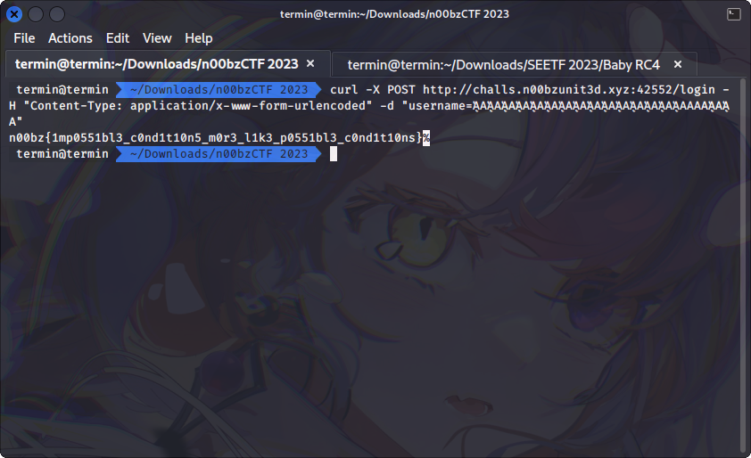

# Conditions

## Deskripsi
Come and get the flag... Only if you can pass these impossible to pass conditions! Author: NoobMaster

http://challs.n00bzunit3d.xyz:42552

## Attachment
[server.py](./Challenge/server.py)

## Solusi
Source code yang diberikan seperti berikut ini

```python
from flask import Flask, request, render_template, render_template_string, redirect
import subprocess
import urllib
flag = open('flag.txt').read()
app = Flask(__name__)
@app.route('/')
def main():
    return redirect('/login')

@app.route('/login',methods=['GET','POST'])
def login():
    if request.method == 'GET':
        return render_template('login.html')
    elif request.method == 'POST':
        if len(request.values["username"]) >= 40:
            return render_template_string("Username is too long!")
        elif len(request.values["username"].upper()) <= 50:
            return render_template_string("Username is too short!")
        else:
            return flag
if __name__ == '__main__':
    app.run(host='0.0.0.0', port=8000)
```

Dari source code tersebut kita perlu memasukkan username agar tidak masuk ke kondisi dari username yang terlalu panjang atau username terlalu pendek.
Namun bagaimana caranya mengirimkan username yang tidak masuk ke dalam kedua kondisi tersebut, sedangkan jika panjang username lebih dari atau sama dengan 40 maka username terlalu panjang dan jika panjang username kurang dari atau sama dengan 50 maka username terlalu pendek.
Disini jika diamati meskipun kedua kondisi tersebut terlihat tidak mungkin untuk mendapatkan flag, namun dari link [berikut](https://stackoverflow.com/questions/57190507/strange-behavior-of-pythons-upper-method) terlihat bahwa nilai dari string biasa dan string yang telah di-uppercase menggunakan fungsi `upper()` bisa menampilkan hasil yang berbeda.

Sehingga kita hanya perlu membuat sebuah username menggunakan karakter khusus tersebut sehingga kondisinya adalah kurang dari 40 karakter jika hanya string biasa, namun lebih dari 50 karakter saat menggunakan fungsi `upper()`.
Disini username yang digunakan adalah seperti berikut ini.



## Flag
### n00bz{1mp0551bl3_c0nd1t10n5_m0r3_l1k3_p0551bl3_c0nd1t10ns}