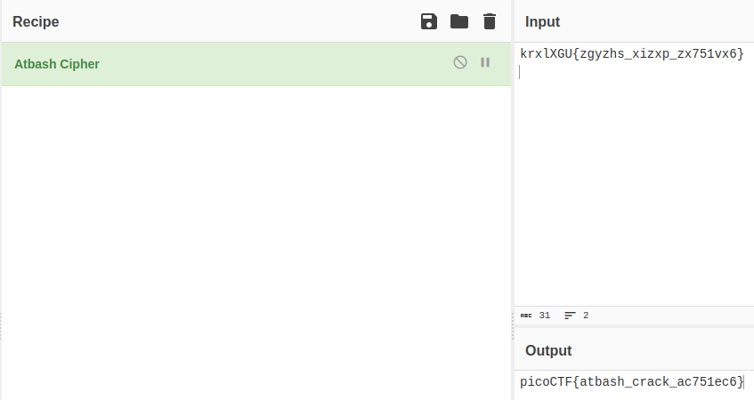

# HideToSee

## Deskripsi
How about some hide and seek heh?
Look at this image [here](https://artifacts.picoctf.net/c/236/atbash.jpg).

## Hint
1. Download the image and try to extract it.

## Solusi
Diberikan suatu gambar [Challenge](Challenge/atbash.jpg). Menurut hint yang diberi, bahwa kami harus melakukan extract pada gambar tersebut. Digunakanlah `binwalk`, tetapi hasilnya nihil. Lalu kami berpikir bahwa bisa jadi merupakan `steganography`, maka kita menggunakan `steghide` sebagai berikut untuk ekstrak gambar tersebut.

```shell
$steghide extract -sf atbash.jpg 
Enter passphrase: 
wrote extracted data to "encrypted.txt".
```

Ternyata terdapat suatu file txt yang disembunyikan di dalam file gambar tersebut. Ketika dilakukan `cat` ternyata flag diencrypt menggunakan `Atbash Cipher` sesuai dengan gambarnya.

```shell
$cat encrypted.txt
krxlXGU{zgyzhs_xizxp_zx751vx6}
```

Di sini kita menggunakan [CyberCher](https://gchq.github.io/) untuk melakukan decrypt menggunakan `Atbash Cipher` dan didapatkan flagnya.


## Flag
### picoCTF{atbash_crack_ac751ec6}