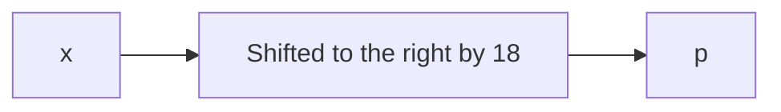

# rotation

## Deskripsi
You will find the flag after decrypting this file
<br>
Download the encrypted flag [here](./Challenge/encrypted.txt).

## Points
100

## Hints
Sometimes rotation is right

## Solusi
Challenge ini menggunakan rotation cipher, yaitu suatu huruf digeser beberapa posisi ke sebelah kanan.
File challenge tersebut isinya sebagai berikut.

```
xqkwKBN{z0bib1wv_l3kzgxb3l_i4j7l759}
```

Format flag dari picoCTF adalah `picoCTF{some_flag}` dan dari huruf pertama file `encrypted.txt` adalah x.
Sehingga rotation cipher yang diperlukan untuk mendapatkan flag adalah seperti berikut ini.



Untuk mendapatkan flag menggunakan [rot13.com](https://rot13.com/) dengan mengubah default rotation yang awalnya 13 menjadi 18.

## Flag
### picoCTF{r0tat1on_d3crypt3d_a4b7d759}
