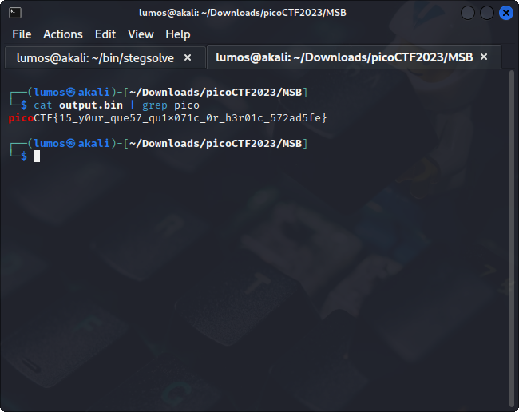

# MSB

## Deskripsi
This image passes LSB statistical analysis, but we can't help but think there must be something to the visual artifacts present in this image...
 
Download the image [here](./Challenge/Ninja-and-Prince-Genji-Ukiyoe-Utagawa-Kunisada.flag.png)

## Points
200

## Hints
What's causing the 'corruption' of the image?

## Solusi
Gambar yang diberikan seperti terdapat noise dan ketika dicek menggunakan `exiftool`, `pngcheck` tidak ada yang aneh.
Kemudian terpikirkan cara untuk menyelesaikan challenge ini melihat dari judul yang diberikan, yaitu MSB (Most Significant Bit).
Di dalam dunia steganography terdapat suatu metode untuk menyembunyikan pesan rahasia pada suatu file lain, seperti PNG, WAV, dll dengan mengubah sedikit nilai binary dari file tersebut sehingga tidak terlalu berbeda dengan file aslinya.
Karena judul challenge ini adalah MSB, kemungkinan pesan rahasia disembunyikan pada bit MSB.

Disini digunakan [stegsolve](https://github.com/zardus/ctf-tools/blob/master/stegsolve/install) untuk mengekstrak data yang ditulis pada bit MSB.
Caranya buka gambar menggunakan `stegsolve`, kemudian klik tab **Analyse** > **Data Extract**.
Karena bit yang akan di extract adalah MSB maka pada bit RGB hanya dipilih bit terbesar, yaitu 7. Seperti berikut ini.

Setelah itu untuk menyimpan data hanya berupa karakter ASCII dari bit-bit binary yang telah diekstrak, pilih **Save Bin**.
Hasil dari flag seperti berikut ini.

## Flag
### picoCTF{15_y0ur_que57_qu1x071c_0r_h3r01c_572ad5fe}
