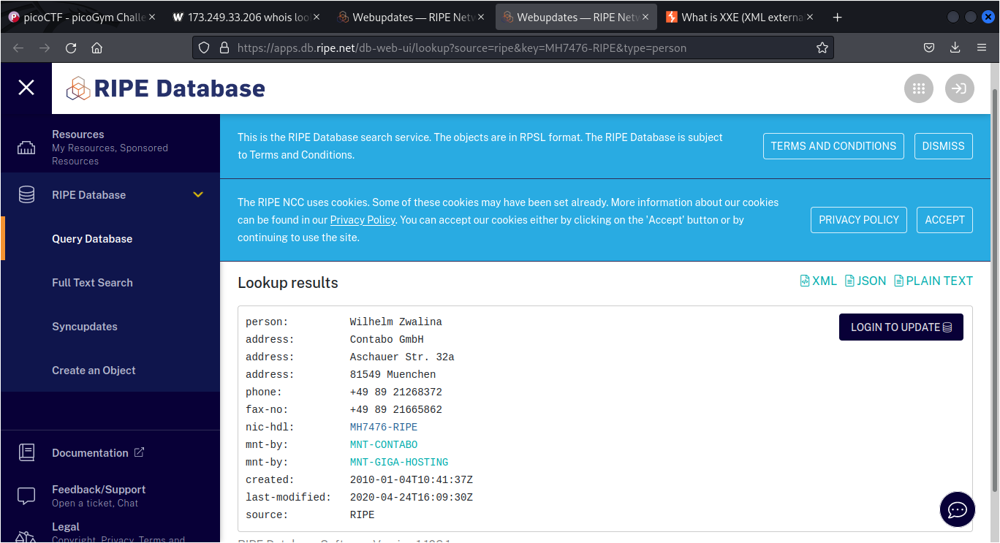

# who is it

## Deskripsi
Someone just sent you an email claiming to be Google's co-founder Larry Page but you suspect a scam.
 
Can you help us identify whose mail server the email actually originated from? Download the email file [here](./Challenge/email-export.eml).
 
Flag: picoCTF{FirstnameLastname}

## Points
100

## Hints
whois can be helpful on IP addresses also, not only domain names.

## Solusi
Diberikan sebuah file .eml yang jika dibaca, alamat email pengirim mempunyai IP address `173.249.33.206`.
Digunakan [whois](https://who.is/) untuk mencari tahu record dari IP address tersebut.

Dari hasil pencarian whois, IP address tersebut disediakan oleh RIPE dan disitu terdapat URL untuk mencari tahu lebih lanjut mengenai IP address tersebut.

Pencarian lebih lanjut dilakukan pada link [berikut](https://apps.db.ripe.net/search/query.html) dengan memasukkan IP address `173.249.33.206`.
Pada hasil pencarian, terdapat bagian `admin-c` atau `tech-c` yang merupakan contact person dari yang menggunakan IP address tersebut

## Flag
### picoCTF{WilhelmZwalina}
