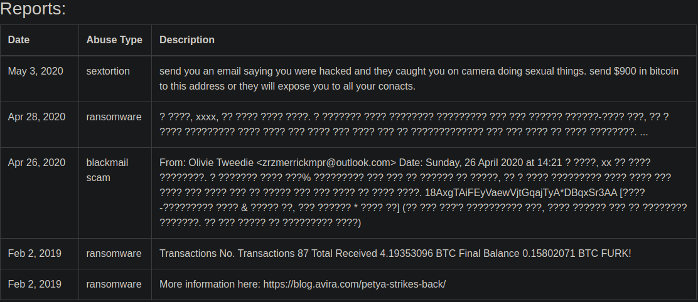

# money-ware

## Deskripsi
Flag format: picoCTF{Malwarename}
The first letter of the malware name should be capitalized and the rest lowercase.
Your friend just got hacked and has been asked to pay some bitcoins to 1Mz7153HMuxXTuR2R1t78mGSdzaAtNbBWX. He doesn’t seem to understand what is going on and asks you for advice. Can you identify what malware he’s being a victim of?

## Hint
1. Some crypto-currencies abuse databases exist; check them out!
2. Maybe Google might help. 

## Solusi
Pada deskripsi terdapat sebuah string `1Mz7153HMuxXTuR2R1t78mGSdzaAtNbBWX`. Ketika dilakukan search untuk string tersebut, muncul hasil yang mana string tersebut merupakan address dari transaksi bitcoin. Digunakanlah website [Bitcoin Abuse Database](https://www.bitcoinabuse.com/), lalu kita cari address dari transaksi tersebut. Ketika discroll dibagian bawah terdapat tabel pada baris terakhir kolom ketiga terdapat nama ransomware, yaitu `Petya`.

## Flag
### picoCTF{Petya}