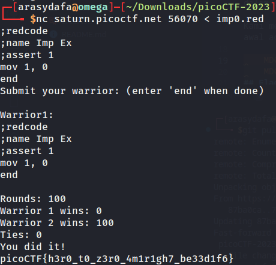

# Ready Gladiator 0

## Deskripsi
Can you make a CoreWars warrior that always loses, no ties?
Your opponent is the Imp. The source is available here. If you wanted to pit the Imp against himself, you could download the Imp and connect to the CoreWars server like this:
`nc saturn.picoctf.net 56070 < imp.red`

## Hint
1. CoreWars is a well-established game with a lot of docs and strategy.
2. Experiment with input to the CoreWars handler or create a self-defeating bot.

## Solusi
Challenge ini merupakan suatu suatu permainan bernama `Code Wars` yang mana didasarkan pada bahasa pemrograman bernama `Red Code`. Di dalam satu permainan `Code Wars`, dua program berusaha menghentikan satu sama lain dengan cara overwrite perintah yang akan dieksekusi oleh program lainnya.

Pada challenge kali ini telah diberikan suatu file awal [Awal](Challenge/imp.red) yang mana harus kita modifikasi sedemikian rupa agar Warrior kita selalu kalah dalam setiap ronde permainan. 

Kami mencoba memodifikasi file awal tersebut menjadi file [Fight](fight.red), baris yang kami rubah adalah pada `mov 0, 1` menjadi `mov 1, 0`. Karena pada program awal adalah `mov 0, 1` yang mana berarti memindahkan nilai 1 ke alamat memori 0 menjadi `mov 1, 0`, yang mana kami harapkan warrior kami agar selalu kalah.

Ketika kita menjalankan koneksi ke CoreWars server dengan file [Fight](fight.red) sebagai inputnya dan kita dapatkan flagnya.

## Flag
### picoCTF{h3r0_t0_z3r0_4m1r1gh7_be33d1f6}
